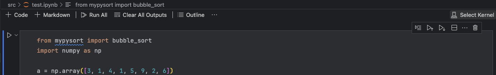
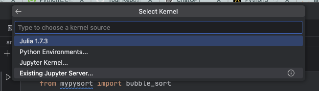
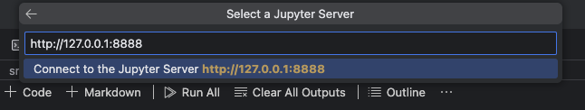
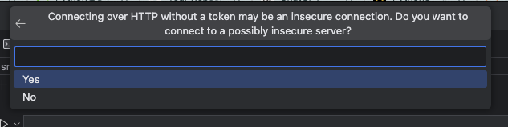
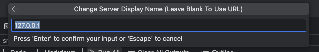
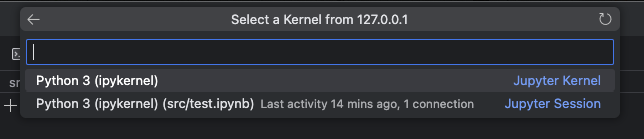
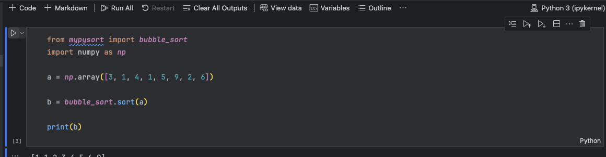

# ソートアルゴリズムを学ぶためのリポジトリ

## 各アルゴリズムの README

[バブルソート](./clibs/bubble_sort/README.md)

## 各アルゴリズムの C 言語での実装について

### ファイル構成

各アルゴリズムは、`clibs`ディレクトリの中でディレクトリ分けされていて、それぞれ C 言語の共有ライブラリとして実装されています。各アルゴリズムのディレクトリには、以下のファイルが含まれています。

- `include`ディレクトリ: ヘッダファイル。特に、`lib.h`は外部へ関数を公開するためのヘッダファイルになっています。
- `src`ディレクトリ: ソースファイル。特に、`lib.c`は外部へ関数を公開するためのソースファイルになっています。
- `test`ディレクトリ: テストファイル。特に、`test.c`は各アルゴリズムのテストを行うためのファイルになっており、共有ライブラリとは別にコンパイルされるようになっています。

### テストの実行方法

`test.c`を実行するには、**各アルゴリズムのディレクトリ**に移動して、以下のコマンドを実行してください。例えば、バブルソートの場合は、`bubble_sort`ディレクトリに移動してください。

```bash
cd ./bubble_sort
docker compose up
```

C のソースコードを変更しても、`--build` オプションをつける必要はありません。`docker compose up`のみで、新しいバイナリがビルドされます。

## Python について

Python によって、C 言語の共有ライブラリを用いて、`numpy`の配列のソートを行うことができます。

### 起動方法

`sort_algorithms` ディレクトリに移動して、以下のコマンドを実行してください。

```bash
docker compose up
```

なお、C や Python のソースコードを変更しても、`--build`オプションをつける必要はありません。`docker compose up` のみで、新しいバイナリがビルドされます。C や Python のソースコードを変更した場合は、`docker compose up`を再度実行するか、現在実行中のコンテナ内で`cd /app && ./setup.sh`を実行してください。

`docker compose up`を起動してしばらく待つと、`Jupyter notebook`が起動しますので、ブラウザで`http://127.0.0.1:8888`にアクセスしてください。

VS Code 上で`ipynb`ファイルを開いてコードを実行したい場合は、`Jupyter Notebook`が起動したあとで、以下の操作を行なってください。

#### 右上の`Select Kernel`をクリック



#### `Existing Jupyter Server...` を選択



#### `http://127.0.0.1:8888`を入力して、Enter



#### `Yes`を選択



#### 適当な名前をつける（どうせ Docker を落とすと使えなくなるので、デフォルトのままでも OK）



#### `Python3 (ipykernel)` をクリック



以上で、VS Code 上で`ipynb`ファイルを開いてコードを実行することができます。いつも通り、三角ボタンからセルを実行しましょう。



### Python ライブラリの使用方法

Python によるラッパー関数は、`mypysort`というライブラリにまとめてあります。すでに`pip install`済みです。`mypysort`ライブラリにはさらに各ソートごとにモジュールが分かれています。例えば、バブルソートは`mypysort.bubble_sort`モジュールにまとめられています。

各モジュールには、`sort`関数を必ず含みます。それ以外に便利な関数があれば、それも含まれています。
